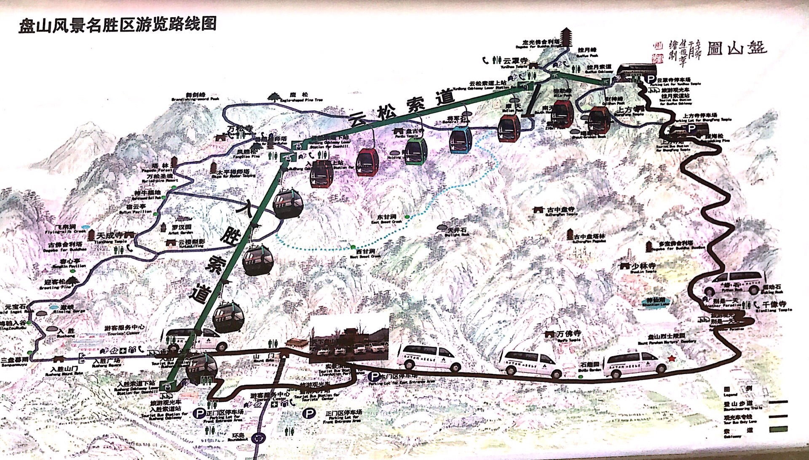

# 天津

## 攻略
[游走天津：充满异国情调的相声之城](http://www.mafengwo.cn/gonglve/ziyouxing/39751.html)

[天津蓟州盘山风景区一日游详细攻略(含行程路线表)](http://www.mafengwo.cn/i/6975920.html)

## 路线

两日游行程路线推荐：
- D1-意大利风情街——天津之眼——夜游海河
- D2-杨柳青镇——五大道——西开教堂——相声

## 景点
### 意大利风情街

### 天津之眼
- 70元/人

### 杨柳青镇
石家大院
- 28元/人
- 杨柳青博物馆

马家馆
- 烧卖

### 五大道

### 西开教堂
- 开放时间：平日5:00-16:30，周日5:00-20:00  
- 地址： 天津市和平区西宁道东段（近滨江道）

### 极品相声帮(天街店)
- 64元/人

### 天津古文化街

### 海河观光游船
- 航班线路：天津之眼--大悲院商贸区-三岔河口-金刚桥-望海楼教堂-狮子林桥-古文化街-金汤桥-冯国璋故居-袁世凯宅邸--进步桥-意式风情区-北安桥-金街-津门津塔-大沽桥-解放北路金融街-世纪钟--天津站-解放桥（行程50分钟左右）
- 古文化街码头 10:00 15:00 19:30
- 大悲院码头 15:00 19:30
- 意风区 15:00 19:30 20:30
- 天津码头 15:00 19:30

### 文庙博物馆
- 30.0元/人（持卡免费不限次）
- 天津南开区鼓楼东街2号文庙博物馆
- 开放时间：09:00-16:00（每周一闭馆）
### 戏剧博物馆
- 10.0元/人（持卡免费不限次）
- 天津市南开区城厢中路东门内大街257号
- 开放时间：09:00-16:00（每周一闭馆，周日下午年卡无效)
### 张学良故居
- 40.0元/人（持卡免费不限次）
- 天津市和平区赤峰道78号(距瓷房子50米，近滨江道)
- 开放时间：09:00-16:30

## 蓟县
### 盘山风景区

- 1月1日-12月31日 周一-周日
- 08:00-16:00
- 天津市蓟县官庄镇莲花岭村（蓟县西北15公里处）
- 盘山门票:成人票100人民币
- 盘山门票+上行云松索道:160人民币
- 盘山门票+上行电瓶车+挂月索道上行套票:200人民币
- 半票:1.2米至1.4米儿童、学生、60至69岁老人享半价优惠。
- 免票:1.2米以下儿童和70岁以上老人免票。

* 缆车
A入胜索道：正门-万松寺 ，8分钟单程60元，（这段不建议坐，是盘山精华部分，建议徒步游览）
B云松索道：万松寺-云罩寺（顶），28分钟单程60元，这段必须要坐，要是步行的话，上山最少需要五个多小时，下山也得三四个小时
C揽月索道：上方寺-云罩寺（顶），4分钟单程40元，这段是从东线坐观光车到上方寺后，必须要坐这段到山顶

大门票：130元
观光车上行通票：100元(含挂月索道上行)
云松索道下行：60元

## 导游
### 天津古文化街
- 津门故里
```
亲爱的游客朋友,眼前这座精美的牌坊就是“津门故里”了。“津门”,乃是天津的别称,“故里”是老地方的意思,所以“津门故里”四字可翻译为天津卫的老地方,也有天津卫的发祥地的意思。津门故里牌坊是天津古文化街的南口牌坊,为仿清式建筑,一间二柱,橄榄绿琉璃瓦,翅角精致,上面尽是五彩斑斓的祥龙、卷草牡丹纹雕刻,玉砌雕阑,美轮美奂。匾额上从右到左四个金光闪闪的大字“津门故里"跃然其上,十分夺目。透过牌坊望进去,人群熙攘的街市出现在眼前,街道两旁的酒楼茶馆是清一色的复古建筑,时不时会出现几面小旗,上面写着店名,像极了古时候的闹市,让人忍不住想要进去与他们融为一体。
```
- 天津古文化街-民俗文化博览园
```
亲爱的游客朋友,现在您来到的地方是民俗文化博览园。天津市民俗文化博览园由妈祖文化广场、天津民俗博物馆、联升斋刺绣艺术博物馆、老美华华夏鞋文化博物馆和国粹宫典藏博物馆等组成,是一个内涵丰富的、集旅游与学习于一体的地方,在这里,您可以观赏、学习、研究各种有趣的文化。妈祖文化广场中最瞩目的自然是通体由汉白玉雕刻的妈祖雕像,此雕像总高度达到九米六,意为妈祖娘娘岀生于公元960年。天后娘娘面目慈善,温婉贤德,含着笑俯视众生,让每一个经过的游人心里都不禁升起敬意;天津民俗博物馆以展示天津漕运、渔盐、民间手工、戏曲艺术为主题,向每一个观光者讲述着海河儿女传统生活方式和发生在那里的故事。馆前有船形花坪,几棵小树生机勃勃,一如沿海人民那淳朴善良热情的民风;联升斋刺绣艺术博物馆有—“镇馆之宝”,您不得不去瞧瞧一一宽1米、长12米的《天后圣迹图》壁画长卷。这一壁画震惊了无数看到它的每一位游人和艺术家;老美华华夏鞋文化博物馆展示各式各样的中华传统鞋履精品,而天津国粹宫博物馆则以展示古玩珍宝为主,古色古香。亲爱的游客朋友,博物馆兼游玩和获得知识技能于身,是提升自我开拓眼界的最好去处,如果您有兴趣的话,不妨去走一走!
```
- 天津古文化街-国粹宫博物馆
```
亲爱的游客朋友,现在您来到的地方是国粹宫博物馆。国粹宫博物馆位于南开区民俗文化博览园中,博物馆前绿树成行,绘有回形纹的牌匾有金色大字:国粹宫,韵味十足。国粹宫博物馆以展览各类珍宝古玩,杂项包括文房四宝、铜器等,集收藏之大观,是收藏家和古玩爱好者的好去处。您可以在这里见到各种精致、奇特的文物古董,包括传世品和地下出土品。说起来,您别看这小小一个古董,其实它背后的故事说不定十分深厚,都说文物是人类文明和历史的缩影,您看到的每一个物件,都曾见证了天津乃至中国的过去、这么一件小小的物品有着如此的魅力,所以说历年来藏玩之风能说有增无减。如果游客朋友您也对这类有兴趣,不妨去参观参观。
```
- 华夏鞋文化博物馆
```
亲爱的游客朋友,现在您来到的地方是华夏鞋文化博物馆。顾名思义,华夏鞋文化博物馆展出的物品自然是各式各样的传统鞋履,包括真正的古代遗存品和后期仿制品,共设置鞋履历史、鞋履民俗、精品靴鞋等6大板块56个专题。“鞋履历史”涵盖远古、商周、秦汉三国、唐宋元明清、民国、新中国成立后等各个时期。在这里,您不仅可以饱览中华民族数千年以来的、形态各异的鞋,如宫廷龙靴、大禹石履、香料抽屉鞋、步步生花鞋、科举作弊鞋..这些听起来就很有趣的鞋子,还可以了解到各种关于鞋履的民俗文化,丰富自己的知识库。所以,亲爱的您对此感到有兴趣的话,就赶紧与小驴儿一起携手到这里来一场与“鞋”的约会吧!
```
- 联升斋刺绣艺术博物馆
```
联升斋刺绣艺术博物馆坐落于天津古文化街,来到此处您便能感受到一股浓烈的艺术气息。该馆始建于1893年,距今已有一百多年历史,馆内以展示剌绣艺术精品为主,为我国创新、传承剌刺绣文化作出了重大的贡献。联升斋的刺绣作品不仅在国内闻名遐迩,而且在深受世界各国人民的喜爱,博物馆集互动性、观赏性、趣味性于一体,游客在欣赏精美刺绣艺术的过程中,还可以了解到各种有趣的文化和历史,从而得到文化的熏陶。联升斋刺绣艺术博物馆还有一价值连城的“镇馆之宝”一一《天后圣迹图》,该作品宽一米,长十二米,选用上等真丝面料和高档天然桑蚕丝线刺绣而成,所选用的丝线颜色多达上千种。《天后圣迹图》以妈祖生平事迹为内容,体现了天津妈祖文化与传统刺绣手工艺的完美结合。整幅作品精致华美,每个细节都处理得尤为细致,人物栩栩如生,令每一位观赏者对我国博大精深的刺绣文化感到叹为观止。亲爱的游客朋友,如果您想要进一步了解刺绣文化,不妨到这里看一看。
```
- 天津民俗博物馆
```
亲爱的游客朋友,现在您来到的地方是天津民俗博物馆。天津民俗博物馆位于天津古文化街中心,与天后宫相连,天后宫正殿为主的古建筑群体为馆舍。博物馆以天津漕运、渔盐、民间手工、戏曲艺术为主题,以展示天津民俗民风为基本內容,征集有民俗文物约2000余件。整个博物馆如同-场泛黄的老电影,言语缓慢而富有吸引力,娓娓道来关于天津漕运的兴起、渔盐的发展和各种热情朴素的民俗。每逢重大节日,天津文化博物馆还会在古戏楼和广场举办传统的戏剧演出及民间花会表演,并展卖各种民间艺术品。如果您想进一步了解天津的民俗民风,那么天津民俗博物馆会是您最好的选择。
```
- 碧霞元君殿
```
亲爱的游客朋友,现在您来到的地方是碧霞元君殿。碧霞元君,全称“东岳泰山天仙玉女泰山碧霞元君”,别称泰山圣母、泰山娘娘,是以中国大陆华北地区为中心的山神信仰。关于碧霞元君的来历众说纷纭,且听小驴儿为您一一道来。种说法是碧霞元君为黄帝所遣之玉女。根据《玉女考》和《瑶池记》的记载,黄帝建岱岳观时,曾经派过七位女子到泰山迎接西昆真人,玉女也就是碧霞元君就是七位女子中的得道修仙者。另一种说法是泰山女神,据明王之纲《玉女传》称:“泰山玉女者,天仙神女也。黄帝时始见,汉明帝时再见焉。"还有一种说法是汉代的民女石玉叶。道教认为,碧霞元君庇护众生,惩恶扬善,是道教中的重要女神。民间有俗语:“南妈祖,北元君″,意思就是海神妈祖娘娘和山神泰山娘娘在人们心目中的地位是一致的。虽然存在地域和守护领域的差别,但是这两位女神同样普度众生、舍己为人,是南北方闻名于世的保护女神,深受人民敬重。每年的四月十八日为碧霞元君诞辰,时各地供奉碧霞元君的殿庙,都会举行隆重的庆典,场面十分热闹壮观。
```
- 元辰殿
```
亲爱的游客朋友,这一站我们来到的地方是元辰殿。元辰殿,为天津天后宫配殿,内供奉斗姆元君。斗姆元君,简称“斗姆”,又作“斗母元君”或“中天梵气斗母元君"。“斗"指北斗众星,“姆”指母亲,道经云,斗姆“为北斗众星之母"。斗姆元君坐于玉池华莲之上,额上有三眼,肩上有四头八臂,法力无边,“能阳能雨能变化,救灾救难救刀兵,祠嗣(si)就生麒麟子,祈名金榜就题名。″惩恶扬善,得到了人们的虔诚信仰。传说斗姆元君原为元始天尊之先天阴气,曾侍奉元始天尊,曾言愿为众生利益诞圣子。托生天竺国,乃周御国王的后妃,号“紫光夫人"。紫光夫人生性善良,常常救助苦难人民。有一年春天,她在莲池中沐浴,忽然诞下了九粒金光闪闪的明珠,其中有七粒排列的形状像一个柄指方的斗勺。这九位圣子也就是北斗九星,即贪狼、巨门禄存、文曲、廉贞、武曲、破军,左辅,右弼(bi)。凡间称虔诚礼拜斗姆元君,可消灾解厄,延年益寿。
```
- 天津天后宫
```
亲爱的游客朋友,现在您来到的地方是天津天后宫。天津天后宫始建于元代,原名天妃宫,俗称娘娘宫,供奉天后娘娘,也就是我们常说的妈祖。妈祖是海边一户渔农的女儿,名林默。传说林默是个百年难遇的奇女子,自幼天资聪颖擅长游泳,最奇的是她竟然还能提前预知海上吉凶,还能乘席渡海,救助海上遇上天灾的船只和渔民,被当地的村民尊称为“通元灵女、“神女"。林默也对这个小渔村有着深厚的感情,立志要终生行善济人,行侠仗义。不过遗憾的是,她在一次海上施援的时候,不幸遇难了。也许上天怜悯,又或者这本就是一场安排,林默非但没有真正长眠反而成了“钦定"的海神。自此人们常常能看到一位红衣仙女在海面上飞行,救助遇难呼救的人,人们都相信那是善良渔女的化身,心里很感激她。后来人们就把海神称为妈祖,还专门设了妈祖庙以上香供奉。随着妈祖的影响力逐渐扩大,妈祖已经不单单是沿海人民的信仰,而成了一种民俗文化在全国流行开来。元朝时的天津是海运漕(cao)粮的终点,是一个装卸漕粮的重要码头,当时海难频频发生,所以当朝皇帝下令建座天后宫,供人们奉祀海神天后,反映了古时人们的淳朴心态。如今的天后宫已成为天津民俗博物馆,用以介绍天津的历史沿革、展示各种民俗风情实物。
```
- 戏楼
```
亲爱的游客朋友,现在您来到的地方是戏楼。戏楼是旧时候表演艺术的场所,如相声、曲艺等。整体外观和整条古文化街的建筑如出一辙,顶盖为绿琉璃瓦,绘有各式各样精美华彩的图案,红漆木扇门一字排开,有一绿漆木栏杄挡在前面。下面则是一空旷的广场,可容纳成百上千的看客。即使是现在,您仍旧能看到这样的盛况:弄堂街巷,舞榭歌台,喝彩声欢呼声连成一片。赶上时候,还会有正宗的天津相声表演,或者魔术戏法,样样精彩有新意,让人感觉到不虚此行。游客朋友,如果您想体验一下在天津老戏楼看正宗的天津味儿表演,不妨到这里来。
```
- 百合亭
```
亲爱的游客朋友,现在您来到的地方是百合亭。百合亭位于玉丰阁之上,整体由黄木建成,共有三个双扇大门,上有八个回形纹边框装饰的玻璃小窗,既娟秀,又有十足的古典气息。阁前植有小树,整个百合亭如含羞带怯的闺阁小姐半躲在绿意莹莹的枝叶后面,遙望过去,如空中之亭台,神秘又唯美。进亭推窗远望,古文化小街小巷错落有致,街市繁华,人群煕攘,浓烈的生活气息扑面而来,像极了一幅鲜活的《清明上河图》,令人心向往之。亲爱的游客朋友,如果您想见识最热闹的天津卫,就到此地游览一番吧!
```
- 严复雕像
```
亲爱的游客朋友,现在您来到的地方是严复故居,而在您眼前的这个雕像,正是严复。严复,是清未极具影响力的资产阶级启蒙思想家,翻译家和教育家。严复一生在近代中国向西方寻求真理的道路上做出了不少贡献,其中主要的成就是翻译了英国生物学家赫胥(xu)黎的《天演论》,“物竞天择,适者生存”“时代必进,后胜于令”等救亡图存理论依据在当时产生了巨大的影响力,还有就翻译工作而言提出的“三字经”一一信、达、雅三字对后世的翻译工作者及行业产生了重大而又深远的意义。严复提倡西学,呼吁变法,注重人才培养,是近代中国开启民智的一代宗师,毛泽东主席还曾称赞他是“中国共产党出世以前向西方寻找真理的一派人物″之一,可见其影响力之深。眼前的"严复”先生一直沉默着,他身着长衫,表情严肃认真,像是思考学术问题,思考怎么救亡图存,隔着大雾重重的岁月之河,我们仿佛可以看到那个意气风发的青年人,正坐在昏黄的灯下,翻阅着厚厚的书籍,日复一日为祖国贡献自己的力量。不知道此时,您的心情是否也和小驴儿一样激动,一样对这位伟大人物更加地敬佩。
```
- 虾米石
```
亲爱的游客朋友,现在您见到的这块石头名叫虾米石。这块虾米石来历可不简单,它是产自于蓟县中上远古界叠层石中的一种,您可以看到它的表面有一些类似于虾米的一点一点的图案,实际上这是由天然沉积而形成的。您别看它净白光滑,可其实这块石头已经有上亿年的历史了呢,因此老百姓推崇其为“长寿石”,不是没有道理的。经过这里的游客们都会伸出手去摸摸它,以祝愿自己或者亲戚朋友长命百岁,健康无忧。亲爱的游客朋友,如果您愿意,您也不妨摸一摸这块长寿石,为您或者您的亲人祈愿呢。
```
- 踩高跷
```
踩高跷(qiao),是一种中国传统民俗活动,俗称缚柴脚,亦称“高跷″、“踏高跷、“扎高脚″、“走高腿"。踩高跷是指表演者人身着戏装,浓妆艳抹,脚上绑着长木跷进行表演。在一些民间节日里,古文化街里常常可以见到这种表演。关于踩高跷活动的起源,民间有个有趣的传说。春秋战国时期,齐国有个人名叫晏婴,此人身材矮小,却能言善辩、聪颖机智。有一次他出使邻国,邻国人看不起他,还拿他的身材进行嘲讽,晏婴就不卑不亢地装上一条木腿再来与他们说话,弄得邻国人啼笑皆非。不过学者们认为踩高跷与原始氏族的图腾祟拜、沿海渔民的捕鱼生活有关。艺术产生的主要动因就是劳动生产。古时有个地方的人们以捕鱼为生,因此发明了脚踩高跷、手拿长木制作的捕鱼工具在浅海中捕鱼的方法。而踩高跷正源于此。当然关于它的起源还有许多说法,有待一一佐证。在每年的天后娘娘诞辰的时候,人们就会举行一场盛大的“皇会”,如果您在这个时候来到天津古文化街的话,就可以观看到这种技艺性强、形式活泼多样的踩高跷表演啦!
```
- 通庆里
```
亲爱的游客朋友,现在您来到的地方是有名的通庆里。通庆里,建于民国初期,原来是一个大银号,后改为民居,是天津规模最大的一组中西合璧四合院式楼房建筑群。里巷出入口处的过街楼口上端镶有蝴蝶状的镂空木雕,寓意“通达吉庆”,取首尾二字,故名“通庆里。由十个独立院落串联组成的中式里巷深又长,仍保留着旧时的模样,青砖灰瓦,木廊漆柱,幽静、古朴,散发着时光的味道。沿着巷子往里走,可见建筑群的墙壁刻有浮雕,生动华美,每一处都展示了一段丰富的情节,如文明娶亲、踩高跷、闹龙舟等,人物、马车等则是栩栩如生,十分逼真,仿佛是在跟路过的每个人诉说着光阴流转的故事。亲爱的游客朋友,,接下来与小驴儿一起到那古巷之中穿行,去细细品味那光阴的故事,去触摸那些时光的痕迹吧!
```
- 官银号
```
亲爱的游客朋友,现在您来到的地方是天津官银号。天津官银号是一座颇具西洋风格的建筑,外观气派大方,又具有复古的味道。二十世纪初,八国联军侵入天津,并纷纷在天津建立银号,造成天津大量物资损耗,金融紊乱,为了恢复国内金融的元气,抗击因为帝国主义侵略所形成的“金融风暴″,清政府开始谋划筹建天津官银号,并希望建成一个能与帝国主义金融业抗衡、交流又能控制京、津区域的金融机构。可以这么说,天津官银号全程记载了中华民族积极抗争外国经济侵略的经历和因旧政府腐败而受过的屈辱。来这里走一趟,您可以强烈地感受到那些屈辱而又奋进的过往,真可谓是一部极好的中国近代历史“纪录片"。
```
- 天津古文化街
```
“潞卫交流入海平,丁沽(gu)风物久间名。京南花月无双地,蓟(jⅰ)北繁华第一城。“初到天津,不知道游客朋友您是不是和小驴儿一样,被那股浓浓的天津味儿吸引住了。淳朴热情的天津人,广泛多元的民俗文化,地道美味的小食,构成了天津独一无二的风情。天津古文化街作为津门十景之,拥有着最浓最正的天津味儿,这里虽说是一条商业步行街,却以一直坚持“中国味,天津味,文化味,古味″经营特色闻名全国。天津古文化街以经营文化用品为主,包括民俗手工艺品、文物古玩、民间曲艺等。您还可以在这里品尝天津最地道的小吃如天津麻花、耳朵眼炸糕、煎饼果子等等,赏玩历史悠久的传统杨柳青年画、泥人张彩塑,观看到踩高跷、秧歌、狮子舞等极具民间风情的表演。天津古文化街的建筑主要是伤清代民间建筑风格,在宫南和宫北两边,各有座彩绘牌坊,分别是津门故里儲牌坊和″沽上艺苑″牌坊。街边的店铺也是凊式建筑为主,一律青墙红柱,高低错落的飞檐翼角,显得典雅、精致,还有装饰彩绘图案如历史、神话、人物、花鸟等的门窗看上去十分精美,夺人眼球,加之门口悬挂的宫灯,为这街道增添不少古朴的韵味。此外,天津古文化街还有天后宫、台湾妈祖庙、严复故居、碧霞元君殿、文化博物馆等著名建筑可供游览。站在街头,耳边叫卖声、嬉笑怒骂声、车轱辘声滔滔不绝,眼前那精美复古的建筑流动、再静止,脑海里一道白光闪过,一瞬间让人误以为自己穿越时空回到了数百年前的天津,成了这里的一员,与这里的人同生活、共呼吸。亲爱的游客朋友,接下来就请您与小驴儿携手一起到那古老的街市走一走,进行一场奇妙的时光之旅吧!
```
- 沽上艺苑
```
亲爱的游客朋友,现在您眼前的就是天津古文化街的“沽上艺苑″牌坊。沽上艺苑,意为″天津卫的文化发祥地″,与“津门故里”有着异曲同工之妙。“沽上”等同于津门,都是天津的意思,因为天津有“沽上”、“津沽”、“直沽”等别称。“艺苑”,可解释为文学艺术荟(hu)萃(cu)的处所。沽上艺苑牌坊是天津古文化街的北口牌楼,标准的仿清式建筑,顶盖为暗绿色琉璃瓦,檐上有雕刻小兽,十分精致。牌坊主色调为青色,有卷草纹、牡丹纹等彩绘图案,两边对称,中间是双龙戏珠。匾额上“沽上艺苑"四个大字是金色的,两旁各有镂空雕龙,气势磅礴,真可谓雕梁绣柱,金碧辉煌。
```

### 津门故里
- 津门故里
```
亲爱的游客朋友您好!欢迎来到津门故里。津门故里即天津古文化街,是天津的“津门十景”之一,景名“故里寻踪"。古文化街位于南开区东北隅东门外,海河西岸,北起老铁桥大街(宫北大街),南至水阁大街(宫南大街)。南北街口各有牌坊座,上书“津门故里”和"沽上艺苑,长687米,宽5米,系商业步行街。之所以在古文化街之外另命“津门故里”之别名,是因为,除了古文化街固有的赏、玩、游、购等特色外,在古代还是祭祀海神和船工聚会娱乐之场所,现今这里还可以寻觅品味到难得的古老文化味道。1985年,天津市政府决定将宫南大街、宫北大街修成古文化街,同时修复“天后宫”。修复后的古文化街全长580米,有近百家店铺以典雅多变、步移景换的建筑风格,成为人们流连忘返的去处。2007年5月8日,天津古文化街旅游区(津门故里)经国家旅游局正式批准为国家5A级旅游景区。古文化街的南、北口,各有一座大牌楼。南口的楼匾写有“津门故里″4字,寓示着今日天津市区就是以这一带为原始中心区域而逐渐开发的而且在六、七百年间这里始终是商业繁华地段,常会使人产生“思古之幽情″。北口的楼匾写有“沽上艺苑"4字,寓示着这里的街貌、店铺、商品,都带有浓郁的艺术气息,尤其是古玩、字画、碑贴、文房四宝和天津民间工艺品,琳琅满目,美不胜收,足可使人受到民族文化的熏陶。这两座耸立在街口的大牌楼,以精致的造型、绚丽的色彩和朴实无华的楼匾题词,扣响游人的心扉,升腾起从历史遐想憧憬美好未来的感情。
```
- 天后圣女
```
在您眼前的这座雕像是天后圣女。史书记载着她姓林,是宋代福建莆田湄州岛人,生于北宋建隆元年(公元960年),卒于北宋雍熙四年(公元987年),因出生后一段时间不会哭,故起名林默。她生在海岛,娴于水性,遂有一个美丽传说流传在民间:“能乘席渡海,云游岛屿间,人呼神女,又曰龙女"。在宋代,我国的航海事业虽有较大发展,但在当时的造船和航海技术条件下,海上安全无保障是严酷的事实。广大从业者幻想有一种超人力量,来保佑他们平安地飄洋过海,林默的一些传说,便很自然地被选中作为超人力量的偶像,成了他们心目中的"保护神。后来的统治者都颂扬她的功德,多次加封之后,成了天后。
```
- 泥人张美术馆
```
现在您来到的是泥人张美术馆。“泥人张″彩塑在清代乾隆、嘉庆年间就已有一定的声誉。“泥人张″-张长林,字明山,生于1826年,卒于1906年。张明山小时候呢,家里特别,他就跟着父亲学捏泥人养家糊口。他最喜欢在集市上观察来来往往、各行各业的人,有时候去戏院里帮忙,看见唱戏的角儿,就偷偷在袖口里捏制。时间久了,他捏出来的泥人个个逼真。后来,他又从绘画、戏曲和民间木版年画中吸收营养,经过十多年的努力,创作出了一万多件作品。他的独特艺术受到人们的喜爱,从此名声大噪,人们也给他取了个亲切的称呼:泥人张。张明山把技艺传给了儿子,儿子又传给孙子、曾孙等,张氏祖孙几代一直继承着这门手艺。1959年,天津成立了“泥人张彩塑工作室,由泥人张第4代张铭主持,培养了一批彩塑艺术人才,使这一艺术不断发展和创新。郭沬若同志曾赋诗盛赞:"用泥造人始女娲,明山泥人锦上花,昨日作人只一家,而今桃李满天下"。来到这里,您可以买些可爱的小泥人当工艺品送给朋友哦!
```

### 天津盘山风景名胜区
- 盘山风景区
```
亲爱的游客朋友,您好,欢迎来到风景秀丽的盘山风景区。当您刚踏上这片土地的时候,就一定感受到了扑面而来的历史气息,希望您可以在小驴儿的讲解中,领略到它背后的故事。游客朋友,您了解盘山吗?盘山,是国家首批的5A级景区,它曾与泰山、黄山、西湖、故宫等齐名,还被列为我国十五大名胜之一,更是以“京东第一山"驰名中外。盘山景观确实是非常吸引人的,不仅平民百姓喜欢来这里游玩,历代帝王将相都竞游盘山。据记载,魏武帝、唐太宗、辽太宗,直到清代的康煕、乾隆等帝王,都曾巡游盘山,留下了许多遗迹、轶事和传说,营造了大量人文景观,其中,乾隆皇帝先后巡幸盘山32次,留下了歌咏盘山的诗作1702首,并发出了“早知有盘山,何必下江南”的感叹。那么,接下来我们就来开启我们的盘山之旅吧!
```
- 盘山索道
```
现在您看到的就是盘山索道了,这是位于盘山的一处景点。开始的运营时间为1994年。盘山索道建在入胜与万松寺小区之间,全长980米,于1994年10月投入运营。乘坐索道可直达中盘胜境一一万松寺。索道单向运行13分钟,沿途可俯瞰浮青岭、天成寺、滴水濑、神牛福地、塔林、东西甘涧,仰观万松寺、舞剑台、雄鹰松等景观景点。
```
- 云松索道
```
这就是云松索道了。索道在盘山的万松寺与云罩寺之间,全长1700米,于2004年6月投入运营。乘坐云松索道可直达盘山顶峰—一挂月峰。索道单项运行28分钟,沿途可俯瞰将军石、盘谷寺、双峰寺,仰观云罩寺、定光佛舍利塔。想要在空中一览盘山美景的话,搭乘云松索道缆车是个很不错的选择哦!
```
- 南天门
```
这里就是盘山的南天门了,它坐落在弥勒峰西,紫盖峰北,挂月峰南。主要有朝天坊、蹬天梯和南天门阁楼等景观。蹬天梯从弥勒峰脚下起步,至日岩和月岩之间,斜长380米,水平投影距离324米,宽3米,相对高差150米。起步处设有玉石牌坊,名朝天坊,宽7米,高7.6米,上有麒麟雕像,刀工精细,栩栩如生。最上处设有南天门阁楼。此阁楼吸纳了我国北方建筑风格创新而成。玲珑剔透、重檐歇山、黄色琉璃瓦屋面,旋式大点金彩绘。上悬有清乾隆皇帝和当代著名书法家所提匾额楹联,正面匾额“南天门”和″千章紫锦″点睛了“雷霆俯视山腰斗,日月横看树林悬"的恢宏景观特色和阁楼的名称。穿越此厅,可领略云罩寺、挂月峰、定光佛舍利塔等殊胜景观,给人以登高望险,“宇宙渺无极,吾心与共宽"的特别感受。
```
- 环翠亭
```
环翠亭,顾名思义,就是亭子的周围被翠绿的植物环绕着,这里也的确如此,小亭的周围是一片养眼的绿色植物,如果您在山上游玩感到疲劳的话,就可以在环翠亭好好地休息一下了。
```
- 入胜
```
当您刚刚步入山门,您便到了“入胜”景点,壁壁题刻便迎面而至。“入胜"为荣禄手书。荣禄,字仲华,清朝未年军机大臣兼直隶总督。入胜,寓意已进入佛教净地。它源于古诗"山色葱茏入胜境,空谷低回溪流声。〃
```
- 三盘暮雨
```
现在您看到的就是津门十景之一的″三盘暮雨”了。“三盘"说的是盘山的"三盘胜境”,“暮雨”指的是傍晩的云气。每当阳春三月,盘山的桃花、杏花、梨花漫山遍野,“东风过岭来,满地翻晴雪”,春风吹过,花瓣随风飄落,如万点花雨。仲夏时节,每薄暮时,雨后初晴,云烟雾霭,浮罩满山,似晴非晴,不雨似雨,故称“三盘暮雨。还有因盘山的山势、气候造成的特殊景观:盘山旖丽的风光,随着高差的变化和季节的变换而各异,形成有"上盘雪花飘,中盘雾雨渺,下盘夕阳照的天然奇观。有诗云:峰秀喷玉珠,惹得柳枝舒。池水映三盘,醉景走不岀。黄昏暮霭、烟雾朦胧之吋,盘山的″三盘”-以松取胜的上盘,以石取胜的中盘和以水取胜的下盘,皆被云气笼罩,身处山中,可见“似晴非晴、不雨是雨”之象。此时“山中云气郁勃弥漫,浩浩如雪海峰峦,出没其中,如烟樯乘风″,盘山显得愈加灵秀壮美,独具魅力。自古以来,盘山的这一独特景观,就被文人墨客所啧啧称道,并称其为“三盘暮雨”
```
- 元宝石
```
在东西浮青岭之间山谷中,两边是险峻的陡壁,清秀的峰峦,涧谷中弯曲的小溪,清流湍急。当道横卧着一块巨石,长数丈,高丈余,上宽下窄,形同元宝,故名元宝石。古密云县的一位举人经过这里,被盘山的美景吸引住了,他想用句话来概括盘山的胜景,于是他便借用了晋代著名书法家王羲之的《兰亭序》中有"此地有崇山峻岭,茂林修竹句,他看到盘山松树长势奇特,岩石形状怪异。因而在这里留下了"此地有崇山峻岭,怪石奇松″。南为傅增湘先生留下的石刻,傅增湘为清未光绪皇帝的启蒙老师,中国商务印书馆的第一任馆长,曾与周学渊、江庸、邢端、周肇祥三游盘山,并写下了《游盘山专号》三卷,为研究盘山历史提供了帮助。
```
- 漱峡
```
您看,我们来到漱峡了!这“漱峡"二字可是著名书法家刘炳南所书的哦,这里的空气是不是也格外的清新?赶紧体验一下这里的清爽气息吧!而且这里还有飞瀑流泉,可谓“瀑布飞泉峰下注,状若缕缕素帛飘”,在这里巡山踏水一定会让您感到心旷神怡的。
```
- 迎客松
```
这一棵就是盘山的迎客松了。沿盘曲石磴山路,步步登高,跨过“仙人桥”,迎面即为有“稀世珍宝”之称的迎客松,这棵迎客松树龄高达400年至600年,仪态肃穆,宛如挥手揖客。
```
- 如如池
```
现在您看到的这个池子名叫如如池。“如如”是佛教用语,指园融而不凝滞的美好意境。这里北望有翠屏峰,两侧有绵延东西浮青秀岭,三面岗峦回围,聚合成幽邃的自然环境。南向展开为旷阔的视野,是奥中有旷的风景胜地,也是通畅而不窒塞,能够聚蓄“地气"的上好风水宝地。有诗描绘其意境∶如如恰将六根移,五韵皆空翠屏齐,祥云卧楼穿窗过,泉池水满山鱼。美景如诗如画,等着您来探秘寻幽。
```
- 石径流泉
```
您走过仙人桥迎面的就是石径流泉了。这里的飞瀑沿山壁陡泻,下自成溪,沿着蜿蜒崎岖的山谷徐徐流下,碧波荡漾,水流遇溪头之巨石而中分,清澈不浊,好一个石径流泉!
```

### 五大道文化旅游区
- 五大道文化旅游区
```
亲爱的游客朋友,欢迎来到五大道文化旅游区,我是您今天的小导游小驴儿,今天就让小驴儿带着您一起来了解一下这里的美丽吧!五大道位于天津市中心城区,这里的南部、动、西并列着成都、重庆、大理、睦南及马场为名的五条街道。这五条街道是迄今天津乃至中国保留最为完整的洋楼建筑群,这也就是我们现在所看见的“五大道文化旅游区"。五大道拥有上世纪二、三十年代建城的具有不同国家建筑风格的花园式房屋,这里大约有2000多所类似的房屋,您可以在这里感受到不一样的建筑风格,更好的感受到不一样的风土人情。在五大道文化旅游区,这里的建筑面积多达100多万平方米,这里最为典型的300余幢风貌建筑屹立在最耀眼的地方,我们亲爱的游客朋友,您一抬头就可以看见这最壮观的景色。这里有很多著名国家的典型建筑,例如:德式建筑、西班牙建筑、文艺复兴式建筑、古典主义建筑,这里不仅仅有西方出名的建筑,您还可以看见中西文化结合的建筑。五大道文化旅游区是天津租借界典型的建筑,这里曾经是天津城南的一片坑洼塘淀,这里曾经修建的都是一些老式的房屋,那时候这里的马路很窄,房屋建筑没有这么多的风格样式,但是因为地理位置优越,它的发展也开始越来越好。后来这里集聚了商界政界的名流,五大道开始成为“国中之国"是因为社会与朝政的更迭,开始变成了各界躲避政治问题的避风港。这里因为靠近海湾,还带动了相关产业的发展,促进了海上贸易的发展,也就造就了我们现在所看见的繁华样子。小驴儿相信我们的游客朋友今天在这里一定会有不一样的体验,一定能够感受到不一样的文化韵味。
```
- 民园广场
```
亲爱的游客朋友,现在您所到达的是民园广场景点。民园广场的前身是民国体育场,民国体育场修建于1920年,它位于五大道中心区域。2012年天津市为保护民国体育场,在这基础上修建了我们现在所看见的民国广场,民国广场是座美轮美奂的英式古典风格的地标建筑,它把西方的文化与美丽精妙绝伦的结合在一起,给人的视觉带来了很大的冲击。民国广场是一座集娱乐、休闲、健身、购物为一体的消费场所。这里有各具特色的文化主题咖啡厅,有异国情调的餐厅,有特色的美食小吃。我们的游客朋友在这里感受到异国情怀,也能体验到天津的特色文化,最重要的是还能吃到美味的食物。
```
- 睦南公园
```
亲爱的游客朋友,现在映入您眼帘的就是睦南公园。睦南公园位于五大道景区的大理道,在睦南公园里五月开始,就会有大片的月季开放,每到那时,这里吸引了来自全国各地的朋友前来拍照。睦南公园里除了广场和大道,剩下的都是草地,这里有大片的植被,绿树成荫,青草茂密,是休闲娱乐的好地方。在睦南公园周围还有许多天津老式建筑的小洋楼,是一道独特的风景线,吸引了无数人们的眼球。这里也是老年人的天堂,饭后散步,健身跳舞的场地,随时可以听见悠扬婉转的歌声伴随着人们美妙的舞姿,人们尽享这其中的乐趣。
```

### 天津意式风情区
- 天津意式风情区
```
亲爱的游客朋友您好,您现在来到的地方是位于天津市河北区的意式风情区。这是一块由五经路、博爱道、胜利路以及建国道合围而成的四方形地区,该区内拥有历史悠久并且保存完整的百年欧洲建筑近200栋。天津意式风情区的前身是意大利在境外的唯一租界,1902年,一纸《天津意国租界章程合同》便将南临海河、北到津山铁路,总计面积771亩的天津土地租了出去。直到1946年,天津意租界才被中华民国政府收回。经过四十余年的租借生活,天津意租界早已成为了除意大利本土之外最大的意式风格建筑群,同时也是亚洲唯一一处具有意大利风格的大型建筑群。因为该区还保留着100余年以前的地中海风情,不仅吸引了大批游客前来游览,还吸引了众多影视剧在此取景拍摄。除此之外,景区还拥有着众多名人故居:大名鼎鼎的梁启超故居一一“饮冰室"就在这里;已经变成渤海商品交易所的曹锟故居也在这里;以及被改为饭店的袁世凯故居亦是在此;这里还有曹禺、张廷谔等近40余位历史名人的故居,十分值得您前去参观。天津意式风情区目前规划分为14个区,依照功能主要设有餐饮娱乐区,展览及配套服务区,精品酒店和旅游配套服务区,精品百货和品牌旗舰店区。在意式风情区,白天和晚上的游玩体验是完全不同的。白天游人较少,漫步其中,就会感觉到好像行走在欧洲小镇上,悠闲而浪漫。而至了晚上,酒吧开业,灯光闪烁,游人如织,就会变得热闹非凡。小驴儿建议您留出一天的时间来好好感受这片美丽的意式风情区,希望您玩得愉快。
```
- 但丁广场
```
您现在来到的地方是但丁广场。在这个广场的中央有一座巨大的雕像,聪明的您应该猜到了这座雕像雕刻的是谁,没错,这是意大利文艺复兴时期的著名诗人阿利盖利但丁的雕像。但丁是13世纪末意大利诗人,欧洲文艺复兴的开拓者,以长诗《神曲》留名后世。他被认为是意大利最伟大的诗人。恩格斯评价但丁说:“他是中世纪的最后一位诗人,同时又是新时代的最初一位诗人"。从如此的高评价上可以看出人们对但丁的崇拜,难怪这里会为他专门竖一座雕像、建一个广场。广场的主题风格为意大利式,与周边意式风情区的风格相协调。但丁广场西对马可波罗广场,周围有王民旧居等众多历史建筑,为游客游览意风区的必到之处。
```
- 马可波罗广场
```
您现在来到的地方是马可波罗广场。该广场占地面积为2200平方米,是原意大利租界的中心建筑,它以13世纪来自意大利的旅行家马可波罗来进行命名。马可波罗广场的正中央有一尊高达136米的和平女神雕塑,雕塑全部由花岗岩雕成,在雕塑的基座装饰了4个欧式人物雕像,在人物雕像下的是喷水口。柱基上方的和平女神铜像姿态优美,手拿一枝橄榄枝,象征着“友谊和平″这一永恒的主题,远远看去,和平女神似乎即将展翅飞去呢。这个雕塑是为了纪念第一次世界大战胜利而建造的。您知道吗,这个雕塑可是在意大利建成后再运到天津来的呢。
```
- 奥式风情音乐公园
```
您现在来到的地方是位于海河沿岸的一座整体形状酷似小提琴的街心公园,它有一个很好听的名字,叫做奥式风情音乐公园。如同该公园的名字一样,这是一家以音乐为主题的公园,在公园中有五个铜像,分别雕刻着的是五位著名的音乐家∶李斯特、贝多芬、施特劳斯、海顿和巴赫。公园最引人入胜的景致是三块修剪整齐的绿地,它们分别种植着黄色的金叶女贞、红色的紫叶小檗和绿色的薯块这三种植物,三种颜色组合在一起,宛若一块地毯的图案。而三块绿地的圆弧恰好围成了公园的中心建筑,一座三层、直径14米的水池,底层由几个小天使相围,顶层是一座女神雕像。由于公园环境优美,这里经常可以看见前来取景的照相馆和电视剧组哦
```
- 梁启超纪念馆
```
您现在来到的是梁启超纪念馆。小驴儿知道,对于“梁启超”这个名字您一定不会感到陌生。他倡导新政,是维新变法的领导者之一,和他的老师康有为一起合称为“康梁”,是中国近代史上十分具有影响力的人物。梁启超纪念馆占地2500平方米,主要分为梁启超故居和饮冰室"书斋两个部分。纪念馆内的一百多件家具都是按当年的陈设原版复制的,并根据梁启超后代反复回忆进行布置的,力求贴近当年原貌。梁启超旧居是一幢二层小洋楼,前后共有两幢,两楼之间通过天桥连接。前楼是砖木结构的主楼,带地下室,分为东西两部分,东面是梁启超专用的小书房、客厅和起居室等;西面是其他家属的住房;后楼为附属建筑,厨房、锅炉房、佣人住房等就设置在这里,高度真实地还原了梁启超的生活环境。而"饮冰室″书斋是一栋浅灰色两层洋楼,一楼是书房,二楼是卧室与客厅。梁启超后期的许多著述与文章都是在这里完成的。梁启超前后在这里居住了15年,潜心著述,直到因病去世。
```

### 天津水上公园
- 水上公园
```
天空一声巨响,小驴儿闪亮登场。亲爱的游客您好,我是您这次天津水上公园欢乐之旅的贴心小棉袄小驴儿。首先,容我介绍一下。天津水上乐园景名为“龙潭浮翠”,听到这里,您也许会纳闷一一为什么叫“龙潭浮翠”呢?原来这片湖水名叫青龙潭,当地有民间神话传说主管大青河的青龙因为曾擅作主张私自给干旱的天津卫南一带播雨,拯救百姓而触犯了龙王。龙王很生气,后果很严重,青龙被龙王押到这里的上空斩首。青龙耗尽最后一丝力气,勾雷引电,轰隆隆地下了最后一场雨。磅礴大雨一柱倾泻,在这里形成了一个碧蓝的大水潭,人们为表示对青龙的敬仰和感激,故把这湖叫做青龙潭。青龙潭建成水上公园后,水上11个小岛堆蓝萓绿,水面荷叶浮翠飘香,因此景名就叫“龙潭浮翠”了。这景名不仅恰当,而且优美生动,为众人所激赏,不多时就被传开了。再说水上公园。它修建于1950年,位于天津市区西南,占地200公顷,三湖十一岛,水域面积89.2公顷,以水景为特色,历有“北方小西子”之称,是天津最大的综合性水上公园,同时也是“津门十景”之一。园中南、北部分为大块陆地,中问间是广阔的水面,水中有11个小岛,分别由拱桥、曲桥、平桥和桃柳堤连接,湖水映着朱红楼阁,湖中碧波荡漾,翠堤览胜、桃柳宜春、秋宇清霜、冬宜雪韵等景观区域季相突出,构成这座独具特色的“北方西湖,水上四季”水上世界。如此风景秀丽的水上公园自建园以来,就先后接待过毛泽东、周恩来、徐特立、贺龙、陈毅、吕正操、谢觉哉、杨成武、李鹏、李瑞环、倪志福、朱镕基等一大批党和国家的重要领导人;也接待过周汝昌、冯骥才等不计其数的文化名人全国著名书画家王学仲、孙其峰现仍担任着该园龙潭书画院名誉院长,以及大量影视明星也曾到这里拍摄影视剧;更是接待过西哈努克等国际友人。水上公园不仅是天津市民游乐休息的场所,更是中外游客慕名而来的重要景点处所。我们这就进园游览,一同领略水上公园的无穷魅力!
```

### 石家大院
- 石家大院综述/正门
```
石家大院坐落在千年古镇杨柳青,始建于1875年,是一座巳有140年历史的大型清代民宅。其建筑结构独特,砖木石雕精美,气势宏浩典雅,是我国北方最大的民宅。原为清末天津八大家之一石元士住宅。石家原籍山东,祖辈漕运发家后在清乾隆年间定居杨柳青。石家于清道光三年(1823),析产为四大门,分别是福善堂、正廉堂、天锡堂、尊美堂。各门均建有一所颇具规模的建筑。现石家大院即为"尊美堂”宅第,曾有“天津第一家"、“华北第一宅”之称,从中足可领略汉族传统民居建筑之精妙。
```
- 全景模型展览
```
游客朋友您好,欢迎您来到我馆参观,杨柳青博物馆原系天津八大家之一石元士的住宅,石家祖籍山东省莱州,明代时起以漕运粮食为业,盈利渐丰。在杨柳青落户以后便广置田产、重利盘剥,明末清初便发展成为拥有四万多亩土地的大地主。清嘉庆四年(1799),乾隆的宠臣和珅获罪赐死,有一使女携带珠宝岀逃,被石万程停泊在通州的粮船收留,由此石家财富骤增,石万程为最早来杨柳青定居的石氏创业人。石元士为石万程的第四代世孙。清道光三年(1823)石家析产共分四大门户,各立堂门,长门福善堂、二门正廉堂、三门天锡堂、四门尊美堂。其中以四门尊美堂治家有道,财丁兴旺,不断扩建为津西第一家,世人俗称“石家大院”(此院为四门尊美堂的宅院,称为尊美堂大院)。石家大院大规模建筑始于光绪初年(1875),历经十几年才建成,仅戏楼、客厅的主体建筑就耗白银30万两,现为所恢复的石府模型,东西宽72米,南北长100米,总的占地面积7500多平方米,建筑面积约3000多平方米,共有十八个院落,是华北地区保存较好,独具特色的大型清代民宅,著名电影表演艺术家石挥就是石氏的第七代世孙。整座院落的建筑布局采用轴线对称式,全院由南至北有一条甬道为中轴线,贯穿四座门楼;东面有五进四合院为过去主人居住的地方,其中的双脊房(鸳鸯厅)为过去石府接待女客人的地方,称为女花厅,最北面的房子为过去石府内账房;西面为石府主体建筑,包括佛堂、游廊院、戏楼、南花厅,戏楼的建筑在全国民宅建筑中实属少见,戏楼的顶子设计巧妙,外面用铁皮封上,再拿铜铆钉铆成一个大寿字,当年著名京剧表演艺术家余舒岩、孙菊仙、龚云甫等都在此戏楼唱过堂会。大院两侧分别有东西跨院,当年女佣人住在东跨院;西跨院包括三个院落,最北面是当时石府家学,后面由男佣人居住。整个建筑均为青石高台、磨砖对缝,房脊山尖、陡板山墙均以砖刻为饰;柱楚石、抱鼓石石雕工艺精细;门窗、隔扇、柱头、雀替、垂花门上的木雕更是玲珑剔透,雕刻图案揽尽民间流传。凤戏牡丹、葫芦万代等题材更为石院增添了风采。石元仕于民国八年(1919)去世,他的夫人携全家迁居天津市内。1948年底杨柳青解放后到1956年,天津专署包括刘青山、张子善等人曾在此地办公,以后作为校舍使用,大量文物流失。文革期间石家大院更是难逃劫难,50%以上砖木石雕被破坏,1/3的宅院坍塌改建。为了抢救这一民族文化遗产,西青区自1987年起相继投资500多万元逐渐修复,1991年被天津市政府批准为市级文物保护单位,被市文化局命名为天津杨柳青博物馆,博物馆可供观赏的内容有:闻名中外的杨柳青年画陈列,具有地方特色的天津婚俗,商俗陈列,具有中国古建筑特色的天津砖雕陈,体现清末民初建筑风格的石院复原陈列。
```